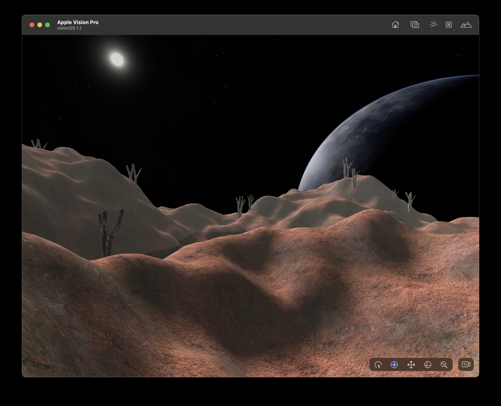
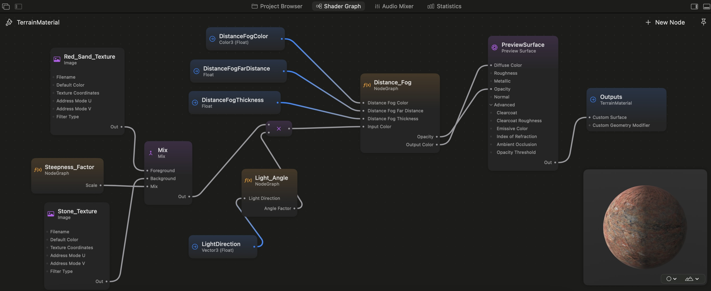

# Red Planet

A small demo application for RealityKit2 / VisionOS that demostrates geometry generated in code as well as the use of custom materials using [ShaderGraphMaterial](https://developer.apple.com/documentation/realitykit/shadergraphmaterial).

# Terrain generation

The terrain is generated using the classic [Diamond-Square](https://en.wikipedia.org/wiki/Diamond-square_algorithm) algorithm.

Gaussian blur (using two-pass application of 1D convolution kernels) is applied to the height map data to reduce spike artifacts.

# TerrainMaterial explained

For a nice Shader Graph primer, see [this WWDC video](https://developer.apple.com/videos/play/wwdc2023/10202/).

For the reference on all the supported node types, see [this page](https://developer.apple.com/documentation/shadergraph/).

NOTE: there seems to be a weird issue with these shader materials created in a an USDx file; their textures _will not work_ in your app unless you create a dummy object in the USDx file (in Reality Composer Pro) _and bind your material_ to it! (Situation Xcode 15.3 Beta). You don't need to use the dummy object, it just needs to be there in the scene file and have your texture bound to it and then you can use your texture for whatever.

## Shader Basic Steps

The shader graph starts by combining 2 different diffuse textures. It uses the `Steepness_Factor` custom node which calculates the 'steepness' of the terrain at each fragment by looking at the Sine of the terrain's normal's Y coordinate value. Based on the 'steepness factor', the 2 textures are mixed together; the other texture favors steeper parts and the other more flat parts.

Then, the `Light_Angle` custom node is used to calculate shadowing from the light source (the star in the sky). This is done by calculating the angle between the surface normal at the fragment and the vector to the light source. Based on this value, shading is applied so that surfaces facing the light source are brighter and surfaces facing away are shadowed.

## Distance Fog

The shader graph includes a distance fog component that calculates the fog as follows:

$f = e^{-d \cdot t}$ 
$c' = (f \cdot c) + ((1 - f) \cdot g)$

Where:

| Symbol | Meaning                                  |
| ------ | ---------------------------------------- |
| f      | fogginess factor, temporary value        |
| d      | fragment distance from the camera        |
| t      | fog thickness factor, scalar (eg. 0.01)  |
| c'     | output color                             |
| c      | input color (from previous shader steps) |
| g      | fog color                                |

## Disabling default scene lighting

To disable the default scene lighting, an Image Based Lighting component is used. The terrain material handles its own lighting based on the light source position.

# Geometry Instancing

The dead trees scattered around the terrain in the application are rendered through [Geometry Instacing](https://en.wikipedia.org/wiki/Geometry_instancing).

In RealityKit, geometry instancing is available through [MeshResource.Contents](https://developer.apple.com/documentation/realitykit/meshresource/contents-swift.struct) API.

# License

This software is available under the [MIT License](LICENSE.md).

# Acknowledgements & attritions

Space skybox texture is a free download from [spacespheremaps.com](https://www.spacespheremaps.com/).

App icon by Toni Itkonen.

Any additional 3D models are free downloads from [blenderkit.com](https://blenderkit.com).

Any additional textures are free downloads from [manytextures.com](https://www.manytextures.com/). Licensed under [Creative Commons Attribution 4.0 International License](http://creativecommons.org/licenses/by/4.0/).

With respect to the author's copyrights.
